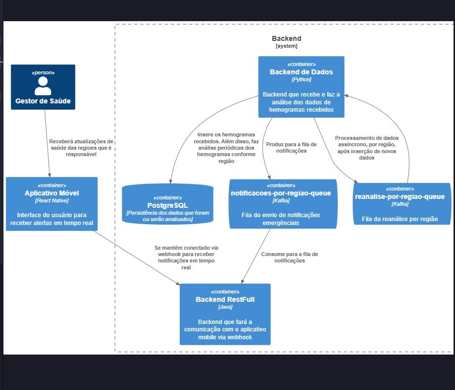

# 📊 Regional Anemia Monitor

Sistema ubíquo para **monitoramento de hemogramas** com foco na **detecção de anemia por região geográfica**.  
Projeto desenvolvido no contexto da disciplina **INF0483 - Software para Sistemas Ubíquos (UFG, 2025/2)**.

---

## 🎯 Objetivo Geral
Desenvolver um sistema de software ubíquo capaz de **receber, processar e analisar hemogramas** digitais,  
detectando casos de **anemia individual** e consolidando os dados para **identificação de padrões epidemiológicos regionais**.

---

## 📌 Objetivos Específicos
- Implementar a **recepção de exames em padrão HL7 FHIR**.  
- Automatizar a **análise individual de hemogramas** para detecção de anemia.  
- Armazenar os exames em uma **base consolidada** com persistência local.  
- Realizar **análises coletivas por região**, identificando padrões de incidência de anemia.  
- Disponibilizar os resultados via **API REST** e **aplicativo móvel Android**.  
- Garantir **segurança, desempenho e privacidade** dos dados de saúde.  

---

## 📅 Marcos de Desenvolvimento

1. **Marco 1 – Recepção FHIR (10%)**  
   Implementação do receptor de mensagens HL7 FHIR com parsing correto dos recursos *Observation*.  

2. **Marco 2 – Análise Individual (10%)**  
   Componente para detecção de anemia em hemogramas individuais.  

3. **Marco 3 – Base Consolidada (10%)**  
   Persistência de exames recebidos em base local operacional.  

4. **Marco 4 – Análise Coletiva (10%)**  
   Identificação de padrões de anemia por região (janelas deslizantes).  

5. **Funcionalidades Avançadas (20%)**  
   - API REST para consultas.  
   - App Android com notificações e visualização de alertas.  
   - Testes automatizados e garantia de qualidade de código.  

---

## 🛠️ Tecnologias Utilizadas
- **Padrões de Saúde**: HL7 FHIR  
- **Protocolos e Middleware**: MQTT, Apache Kafka, gRPC  
- **Aplicações Móveis**: Android (Java/Kotlin)  
- **Infraestrutura**: AWS / Google Cloud  
- **Banco de Dados**: PostgreSQL / MongoDB  
- **Segurança**: HTTPS, mTLS, criptografia de dados  

---

## 📖 Bibliografia de Apoio
- MCGRAW, G. *Software Security: Build Security In*. Addison-Wesley, 2006.  
- GREENGARD, S. *The Internet of Things*. MIT Press, 2015.  
- BUYYA, R.; DASTJERDI, A. V. *Internet of Things: Principles and Paradigms*. Morgan Kaufmann, 2016.  
- Documentação oficial: [HL7 FHIR](https://www.hl7.org/fhir/), [MQTT](https://mqtt.org), [Apache Kafka](https://kafka.apache.org).  

---

## 👥 Equipe
Projeto desenvolvido pelos(as) estudantes da disciplina **INF0483 - Software para Sistemas Ubíquos**  
Universidade Federal de Goiás (UFG) - 2025/2  

## Arquitetura do Sistema
